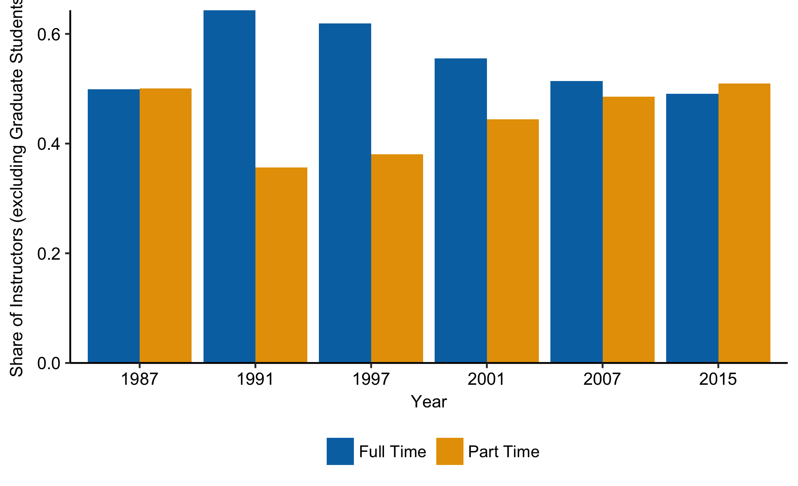
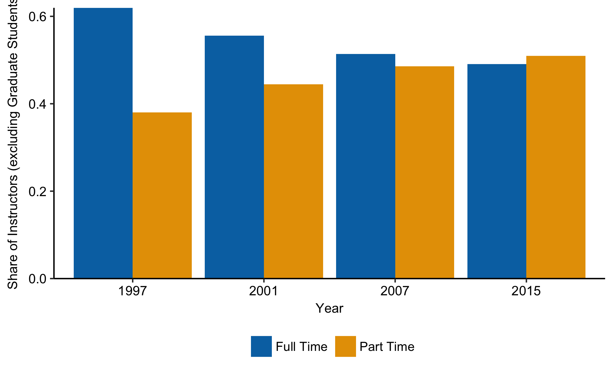
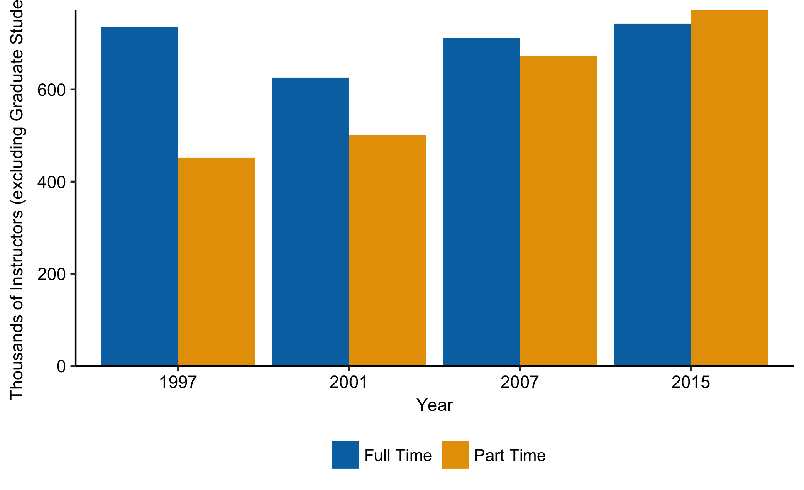
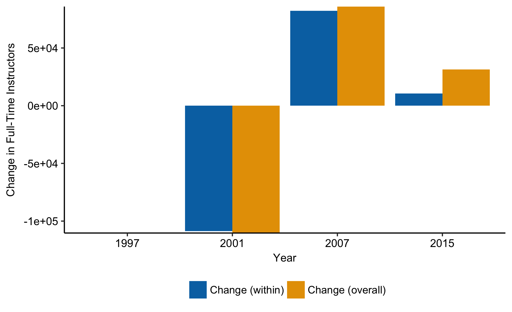
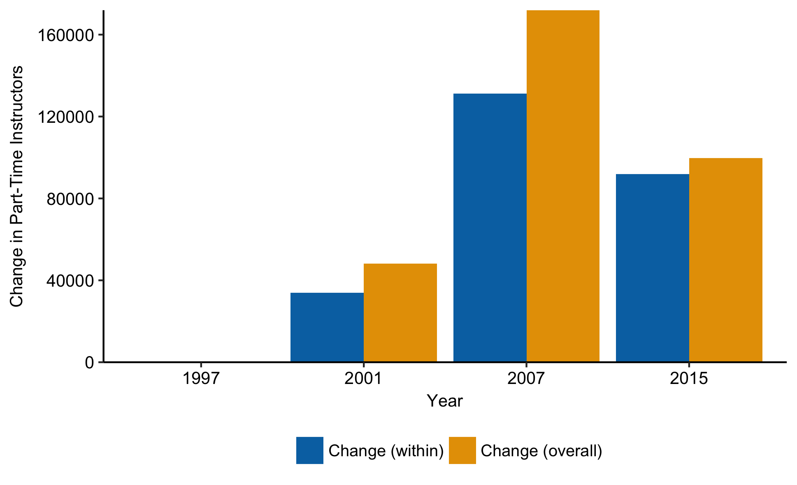
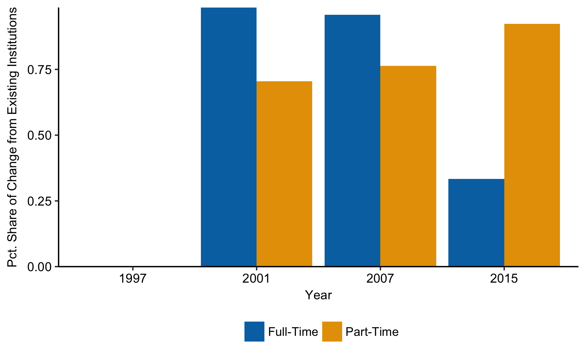

# What is the breakdown between growth full-time and part-time? #

The question: [Noah
Smith](https://www.bloomberg.com/amp/view/articles/2017-10-04/too-many-people-dream-of-a-charmed-life-in-academia)
wrote up a point about how part-time instructors have exploded in the
U.S. I want to know if this is new institutions using part-time, or is
it old institutions switching?

## Data ##
I'm using the 1987, 1991, 1997, 2001, 2007 and 2015 Fall Staff Survey
from IPEDS to look at it. It's a pain to harmonize but I think I
roughly have it. First, I spot checked the result from Noah to my
data. I'm focusing on just full-time faculty vs part-time. I'm
ignoring the tenure-track vs not. I don't think that plays a big role
in the argument, although being full-time non-tenure is also not the
dream for a lot of Ph.D.s.

The other thing I'm ignoring is Graduate Students. Mainly for speed,
this is very gettable from the data. The number I'd like to match is
33/(33+14+34) = 40\% around 1995, and 40 / (29+17+ 40) = 46%
in 2015. If anything, I have a slightly higher number here.  My 1987
data is weird though, and looks like something is off. Otherwise, you
see a trend that is very similar to what Noah was pointing to.

## Decomposing the growth ##
Ok, so what share of this from new institutions vs changes? I assumed
that the institution ID was constant over time to construct a
panel. Then, I can look at the changes over time vs new schools. Of
course, as I do this, I discover the ids for the 1987 and 1991 data
are not working, so I drop those two years. This still leaves us an
interesting 20 years, but not quite as cool.

What I do is take the changes in each period of the raw numbers, and
ask how much of the change is from a change within an institution, and
how much is from new institutions. I first plot the overall number of
each type. Then, I plot the share from within institution vs overall. I

Of that change, existing institutions make up about 75\% of the growth
according to my calculations.

I put my code and data on github here:
